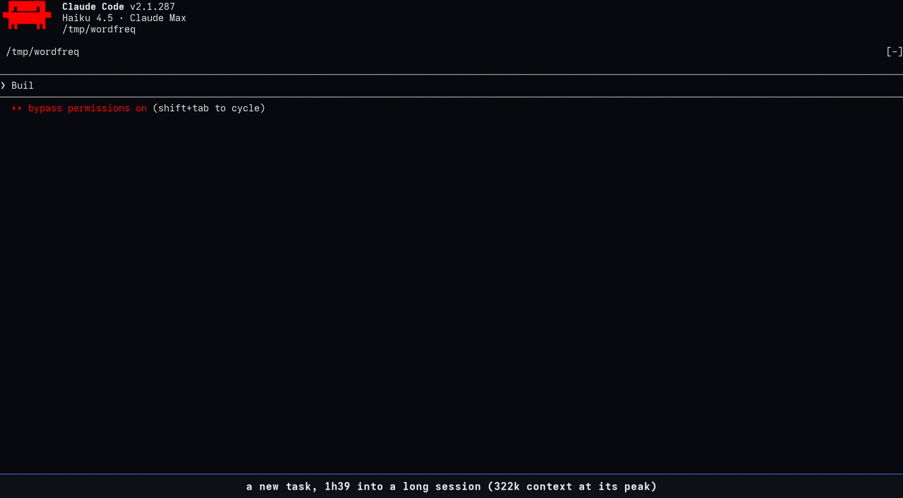

# xray

A Claude Code mod: two cards under the spinner showing what Claude is doing and what is left on
its to-do list, plus a session genome (every step of the session, one colored cell each).



## What it shows

- **Working:** two framed cards under the spinner. Left, **now**: the current step as a colored
  band, a few fact rows (tests, files, the task at hand), the step and context gauges, and the
  folder in its bottom edge. A failing run turns it red. Right, **to-do** (heavy frame): one cell
  per item, done struck through, the live one as a colored patch, `■◆□□ 2/4` in its border.
- **The to-do list is xray's own.** xray answers `TaskCreate` / `TaskUpdate` / `TaskList` /
  `TaskGet` itself, so Claude Code's built-in list never opens; a system-prompt line asks Claude to
  keep one on any task of 3+ steps.
- **Between turns:** one strip above the prompt: context, prompt-cache countdown, what is still
  owed, and the genome.
- **Genome:** each step a cell colored by kind (read, edit, test, commit, agent, memory save…; shell
  commands sorted by what they actually do, so a `grep` reads as a read), turns
  in kind brackets: `( )` only looked, `[ ]` changed something, `{ }` used agents. It is also
  appended to the session's title, so `/resume` lists every session with its genome.
- **`/xray`:** the detail panel: the whole genome with its key, the last turn (red → green and
  the like), the folder and session age, each request's time and token rate, every step.
- Under 60 columns (a phone) the cards fold into one heavy card with the gauges in its edge.

## Install

Function-hook plugin, Claude Code ≥ 2.1.287. In `~/.claude/settings.json`:

```json
{
  "env": {
    "CLAUDE_CODE_PLUGIN_DIRS": "/path/to/xray",
    "CLAUDE_CODE_ENABLE_TODO_TOOLS": "1"
  }
}
```

then start a new session. `CLAUDE_CODE_ENABLE_TODO_TOOLS=1` matters on newer models: without it
Claude Code offers the task tools only to some older ones, and the to-do card stays empty.

## Commands and settings

- `/xray` opens or closes the panel; `/xray on|off` shows or hides the cards;
  `/xray cache on|off` the cache countdown; `/xray rate good|bad <note>` rates a custom task layout.
- `narration` (default off): a one-line » from Haiku at task start and on the first failure, at
  most once a minute, as the now card's last fact row.
- `customCards` (default on): for a git bisect, a benchmark loop, a k/N batch or a long rebuild,
  Haiku lays out a task card from measured widgets; its first row leads the now card's facts.
- `CLAUDE_HUMAN_MODS=off` in the environment turns xray off (used for unattended agent panes).

## oh-my-pi (omp)

`omp/` ports xray to [oh-my-pi](https://github.com/can1357/oh-my-pi) (v18.3.5) as an extension on the
same core, skinned with omp's theme: the now card under omp's spinner in its rounded frame and theme
colours, the genome between turns, `/xray` as a framed overlay (`/xray on|off` hides the card). omp keeps
its own to-do list and status line, so xray draws neither a to-do card nor a folder or context gauge.

```sh
ln -sfn /path/to/xray/omp ~/.omp/agent/extensions/xray   # or one run: omp -e /path/to/xray/omp/index.ts
```

No hot reload in omp: restart (`omp -c`) after a change. Design and decisions: `omp/SPEC.md`.

TODO (omp): narration and custom task cards on omp's `smol` model role; the cache countdown, if omp
ever exposes a cache TTL.

## Development

`claude plugin validate .` and `claude plugin test` from this folder (the omp tests run there too;
`tsc -p omp` type-checks the port). Design history and every
round of feedback: `SPEC.md`.
