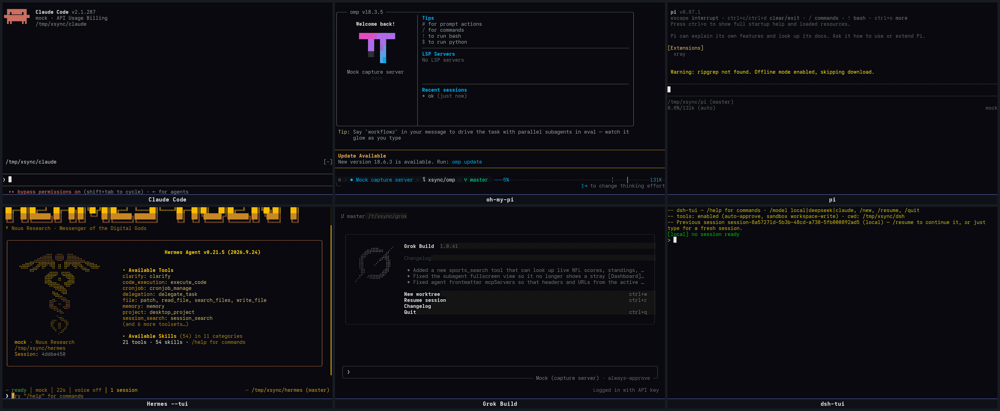
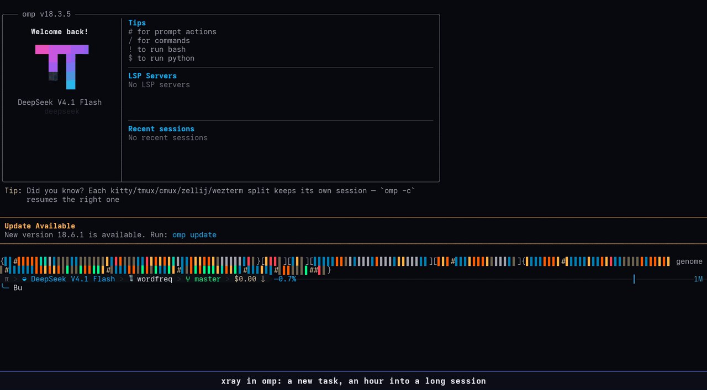
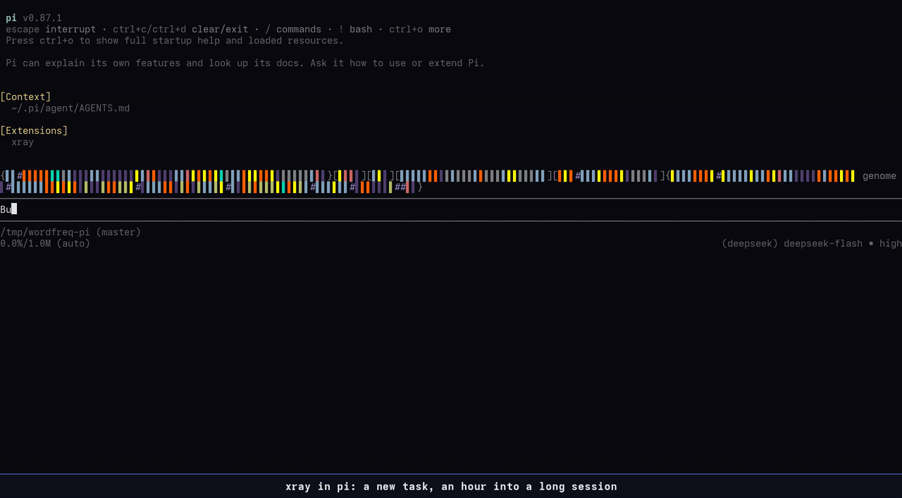
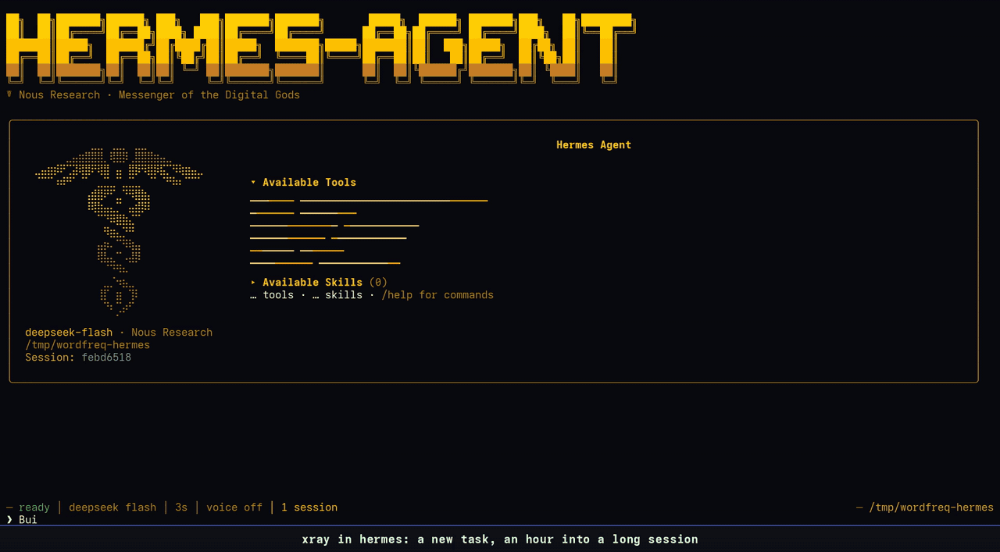
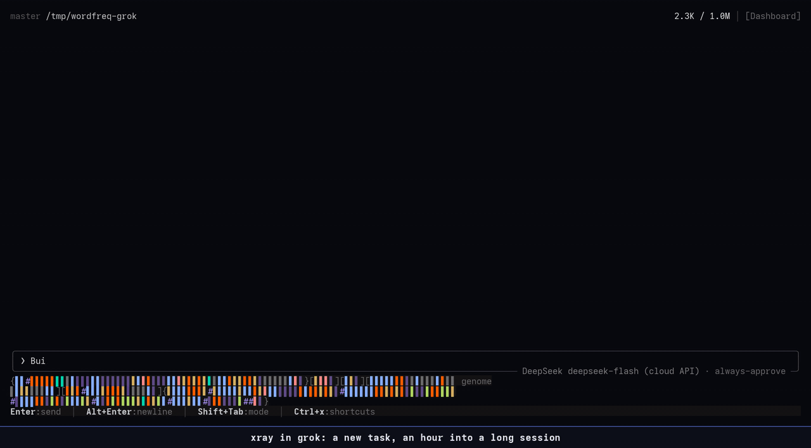
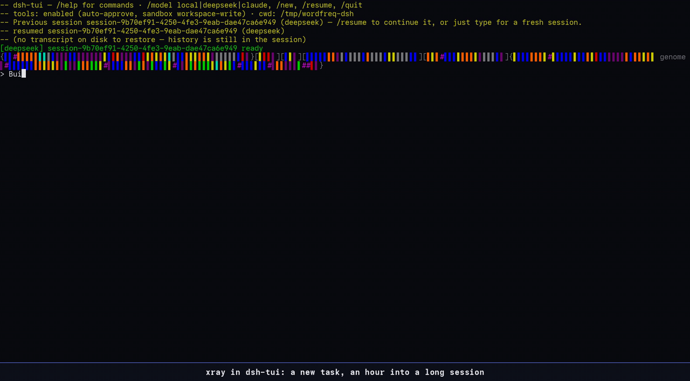

# xray

A glanceable card for coding agents: what the agent is doing right now, and a session genome,
every step of the session as one colored cell. One core (`hooks/`, pure lines of styled segments),
a thin adapter per harness: Claude Code, oh-my-pi, pi, Hermes (`--tui`), Grok Build and dsh-tui.



Six harnesses, one task, in step: each runs against the same scripted model (a local fake server that releases every step to all six at the same instant), so the cards, genomes and panels line up frame for frame. The harnesses and xray are real; only the model is scripted. Live takes on real models are in the Claude Code and oh-my-pi sections.

## What it shows

- **Working:** a framed **now** card under the host's spinner: the current step as a colored band
  (a failing run turns it red), a few fact rows (tests, files, the task at hand) and the gauges the
  host doesn't already show (prompt-cache hit rate, tokens per second, turn time).
- **Genome:** each step a cell colored by kind (read, edit, test, commit, agent, memory save…; shell
  commands sorted by what they actually do, so a `grep` reads as a read), turns in kind brackets:
  `( )` only looked, `[ ]` changed something, `{ }` used agents. Single-card hosts draw it inside
  the now card, right of the facts; Claude Code draws it below its two cards, inside one frame.
- **Between turns:** the genome alone, `genome` at its right edge.
- **`/xray`:** the detail panel: the whole genome with its key, the last turn (red → green and the
  like), each request's time and token rate, every step, the files touched, every turn.
- Narrow terminals (under 60 columns, a phone) fold the card into a compact form.
- Never repeats what the host already draws: no folder, context gauge or to-do list where the host
  has its own.

## Hosts

| Host | What shows | Install |
|---|---|---|
| [Claude Code](#claude-code) ≥ 2.1.287 | now card + xray's own to-do card, genome below; idle strip; `/xray` | `"CLAUDE_CODE_PLUGIN_DIRS": "/path/to/xray"` in settings `env` |
| [oh-my-pi](#oh-my-pi-omp) 18.3.5 | now card with the genome inside; idle genome; `/xray` overlay | `ln -sfn /path/to/xray/omp ~/.omp/agent/extensions/xray` |
| [pi](#pi) 0.87.1 | as omp, card above pi's spinner line | `ln -sfn /path/to/xray/pi ~/.pi/agent/extensions/xray` |
| [Hermes](#hermes---tui) 0.21.5, `--tui` | now card docked above the status bar; idle genome; `/xray` modal | `hermes/build.sh`, two symlinks, one config line |
| [Grok Build](#grok-build) 1.0.41 | now card + genome in the status-line row (≤5 lines); no panel | `grok/install.sh $GROK_HOME` + a `[ui.status_line]` block |
| [dsh-tui](#dsh-tui) | now card above the input row; idle genome; `/xray` full view | adapter lives in dsh-tui (`DSH_TUI_XRAY=/path/to/xray/hooks`) |

Live captures of every host (working card, idle genome, panel): [`HOSTS.md`](HOSTS.md#status-2026-10-06).

## Claude Code


Function-hook plugin, Claude Code ≥ 2.1.287. Two cards under the spinner: **now** (left, with the
folder in its bottom edge and the context gauge) and **to-do** (right, heavy frame: one cell per
item, done struck through, the live one as a colored patch, `■◆□□ 2/4` in its border). The genome
rows sit below them, the frame extended down to enclose them. Between turns one strip above the
prompt: folder, context, prompt-cache countdown, what is still owed, the genome. The genome is also
appended to the session's title, so `/resume` lists every session with its genome.

In `~/.claude/settings.json`:

```json
{
  "env": {
    "CLAUDE_CODE_PLUGIN_DIRS": "/path/to/xray",
    "CLAUDE_CODE_ENABLE_TODO_TOOLS": "1"
  }
}
```

then start a new session. **The to-do list is xray's own:** xray answers `TaskCreate` /
`TaskUpdate` / `TaskList` / `TaskGet` itself, so Claude Code's built-in list never opens; a
system-prompt line asks Claude to keep one on any task of 3+ steps. `CLAUDE_CODE_ENABLE_TODO_TOOLS=1`
matters on newer models: without it Claude Code offers the task tools only to some older ones, and
the to-do card stays empty.

Commands and settings:

- `/xray` opens or closes the panel; `/xray on|off` shows or hides the cards;
  `/xray cache on|off` the cache countdown; `/xray rate good|bad <note>` rates a custom task layout.
- `narration` (default off): a one-line » from Haiku at task start and on the first failure, at
  most once a minute, as the now card's last fact row.
- `customCards` (default on): for a git bisect, a benchmark loop, a k/N batch or a long rebuild,
  Haiku lays out a task card from measured widgets; its first row leads the now card's facts.
- `CLAUDE_HUMAN_MODS=off` in the environment turns xray off (used for unattended agent panes; the
  hermes and grok adapters honour it too).

Under 60 columns the two cards fold into one heavy card with the gauges in its edge.

## oh-my-pi (omp)



An extension for [oh-my-pi](https://github.com/can1357/oh-my-pi), skinned with omp's theme tokens:
the now card under omp's spinner in its rounded frame, the genome inside it, the genome alone
between turns, `/xray` as a framed overlay (`/xray on|off` hides the card). omp keeps its own to-do
list and status line, so xray draws neither a to-do card nor a folder or context gauge.

```sh
ln -sfn /path/to/xray/omp ~/.omp/agent/extensions/xray   # or one run: omp -e /path/to/xray/omp/index.ts
```

No hot reload: restart omp after a change. omp and pi share one adapter (`pifamily/xray.ts`);
`omp/index.ts` only says what differs. Design and decisions: [`omp/SPEC.md`](omp/SPEC.md).

## pi



The same adapter in [pi](https://github.com/earendil-works/pi) (`@earendil-works/pi-coding-agent`, omp's upstream).
pi draws its spinner in the editor's top border, so the card sits directly above that line. Turns
close on `agent_settled` (after retries and compaction), the band takes pi's theme colours, and
pi's `find`/`ls` tools (`pi --tools …,find,ls`) count as reads.

```sh
ln -sfn /path/to/xray/pi ~/.pi/agent/extensions/xray
```

`/reload` picks up edits. Decisions: [`pi/SPEC.md`](pi/SPEC.md).

## Hermes (`--tui`)



[Hermes Agent](https://github.com/NousResearch/hermes-agent)'s full-screen Ink TUI only; classic prompt_toolkit mode shows nothing. A small python
plugin appends hermes' own tool events (its tool names and args) to a JSONL per TUI process; the TUI
widget tails it, maps the names into the core's in `hermes/calls.ts`, and draws the now card in the
bottom dock, the genome between turns, and `/xray` in hermes' own dialog frame (`/xray-card` hides
the card). Colours come from the active skin. hermes' status bar already shows context, folder and
cost, so the card doesn't.

```sh
cd /path/to/xray/hermes && ./build.sh        # esbuild bundle → xray.mjs (ESBUILD=/path/to/esbuild)
ln -s "$PWD/xray.mjs" ~/.hermes/tui-widgets/xray.mjs
ln -s "$PWD/plugin"   ~/.hermes/plugins/xray   # then add `- xray` under plugins.enabled in ~/.hermes/config.yaml
```

A rebuilt `xray.mjs` hot-loads; plugin changes need a TUI restart. Spec: [`hermes/SPEC.md`](hermes/SPEC.md).

## Grok Build



Grok has no widget or overlay API, so xray lives in its status-line row: command hooks append each
event to `~/.grok/xray/<session>.jsonl`, and a status-line command replays it into the now card with
the genome inside (at most 5 lines, GrokNight colours, rounded frame like grok's prompt box), or the
genome alone between turns. grok reports token usage once per turn, so the gauge row is turn time
only. No `/xray` panel.

```sh
/path/to/xray/grok/install.sh "$GROK_HOME"   # builds dist/, writes $GROK_HOME/hooks/xray.json
```

and in `$GROK_HOME/config.toml`:

```toml
[ui.status_line]
type = "command"
command = "node '/path/to/xray/grok/dist/status.mjs'"
```

`dist/` is built with esbuild (`ESBUILD=/path/to/esbuild`). Spec: [`grok/SPEC.md`](grok/SPEC.md).

## dsh-tui



dsh-tui (an Ink TUI over the DeepSeek Harness) carries its own adapter: it feeds the core from its
NDJSON event stream and draws the now card between its status line and input row, the genome
between turns, and `/xray` as a toggled full view. It loads this core from `DSH_TUI_XRAY`
(`/path/to/xray/hooks`). The adapter is not part of this repo.

## Development

From this folder: `claude plugin validate .` and `claude plugin test` (runs every `*.test.ts(x)`:
core, pifamily, hermes, grok). `../check.sh xray` in the parent mods repo also type-checks each
host folder with a `tsconfig.json`. Design history and every round of feedback: [`SPEC.md`](SPEC.md);
the multi-host plan and status: [`HOSTS.md`](HOSTS.md).
